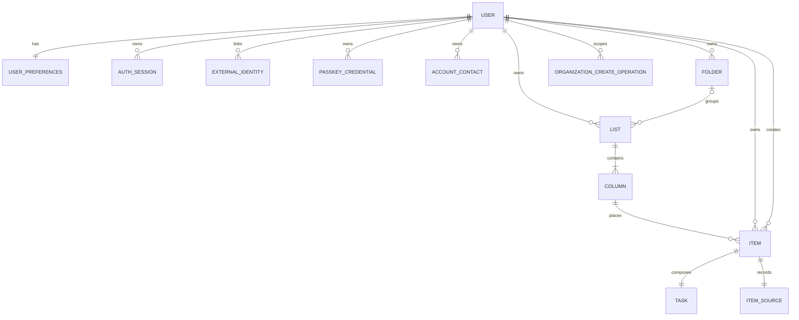

# Dotick Data Design Baseline

> **Status:** Increment 1 backend physical schema implemented locally
> **Date:** 2026-09-08
> **Decision source:** DR-052 / ADR-0002
> **Database:** PostgreSQL

# 1. Scope

این سند storage strategy را می‌بندد و schema لازم برای Walking Skeleton و Increment 1 را مشخص می‌کند. entityهای Incrementهای بعدی فقط زمانی وارد physical design می‌شوند که behavior و decision gate آن‌ها آماده باشد.

# 2. Design rules

- UUID شناسه‌ی عمومی entityها است.
- نام table و column به `snake_case` است.
- timestampهای لحظه‌ای `timestamptz` و به UTC ذخیره می‌شوند.
- business date مانند `occurrence_date` در آینده از نوع `date` است.
- foreign key، unique و check constraint هرجا invariant قابل بیان باشد در database ثبت می‌شود.
- تمام queryهای private باید owner/scope را در predicate داشته باشند.
- migration منتشرشده immutable است؛ تغییر بعدی migration جدید می‌سازد.
- JSONB جای relation queryable یا constraint اصلی را نمی‌گیرد.
- enumهای پرتحول با check constraint/text یا lookup کنترل‌شده طراحی می‌شوند؛ انتخاب دقیق در migration مالک ثبت می‌شود.

# 3. Item persistence strategy

Implementation note (2026-09-08): append-only migrations now create the complete I1 backend schema below. The isolated `foundation_checkpoints` table remains disposable I0 verification data and is not an Item. Future Event/Routine/history/sync fields remain absent until their owning increments.

```text
items
  id PK
  kind
  owner_user_id
  created_by_user_id
  title
  is_trashed
  version
  created_at
  updated_at
       |
       +-- 1:1 tasks
       +-- 1:1 events       (I2)
       +-- 1:1 routines     (I3)
```

این مدل composition صریح است، نه Django model inheritance. ایجاد یا حذف base/subtype باید در یک transaction انجام شود.

Invariantها:

- هر `items.kind = 'task'` دقیقاً یک row در `tasks` دارد.
- subtype row بدون Item متناظر وجود ندارد.
- تغییر kind در Personal V1 مجاز نیست.
- status در `items` قرار نمی‌گیرد.

# 4. Increment 1 schema

## 4.1 Users and preferences

### `users`

custom Django user model باید پیش از اولین migration ساخته شود.

| Column | Type | Constraint / note |
|---|---|---|
| `id` | uuid | PK |
| `email` | varchar | normalized, case-insensitive uniqueness strategy |
| `password` | varchar | Django encoded hash; never plaintext |
| `handle` | varchar | required; unique and case-insensitively unique |
| `display_name` | varchar | required; nonunique |
| `profile_picture_url` | varchar nullable | optional presentation reference; no public-profile surface |
| `email_verified_at` | timestamptz nullable | null until successful verification |
| `is_active` | boolean | not null |
| `is_staff` | boolean | not null |
| `date_joined` | timestamptz | not null |

این fields در migrationهای `identity/0001..0007` تکمیل شده‌اند؛ contract محصول نباید به نام داخلی framework وابسته شود.

### Federated identity, Passkey and contacts

| Table | Key fields / invariant |
|---|---|
| `identity_external_identities` | one `(provider, subject)` globally and one provider identity per User; only `google` is allowed in I1 |
| `identity_passkey_credentials` | globally unique credential ID, public key, signature counter, backup/device metadata and owned display name |
| `identity_passkey_challenges` | random challenge, purpose, optional registering User, expiry and consumed timestamp |
| `identity_account_contacts` | pending/verified secondary email or E.164 phone; verified values globally unique per kind |
| `identity_contact_verification_challenges` | HMAC code digest, ten-minute expiry, single-use state and failed-attempt count |

### `identity_verification_challenges`

| Column | Type | Constraint / note |
|---|---|---|
| `id` | uuid | PK |
| `user_id` | uuid | FK users, cascade |
| `purpose` | varchar | email verification or password reset |
| `code_digest` | varchar | keyed HMAC digest; never plaintext code |
| `expires_at` / `consumed_at` | timestamptz | ten-minute and single-use lifecycle |
| `failed_attempts` | small integer | challenge consumed after five failures |
| `created_at` | timestamptz | issuance throttling and newest-challenge lookup |

### `identity_auth_sessions`

| Column | Type | Constraint / note |
|---|---|---|
| `id` | uuid | PK and JWT `sid` |
| `user_id` | uuid | FK users, cascade |
| `refresh_jti` | varchar | unique current refresh identity; replaced on rotation |
| `user_agent` | varchar | bounded presentation hint, not trusted identity |
| `created_at` / `last_seen_at` | timestamptz | session presentation and ordering |
| `revoked_at` | timestamptz nullable | non-null rejects access and refresh tokens |

### `user_preferences`

| Column | Type | Constraint / note |
|---|---|---|
| `user_id` | uuid | PK, FK users, cascade |
| `timezone` | varchar | valid IANA timezone identifier |
| `day_boundary_offset_minutes` | integer nullable | behavior در I10؛ storage می‌تواند دیرتر اضافه شود |
| `created_at` | timestamptz | not null |
| `updated_at` | timestamptz | not null |

## 4.2 Organization hierarchy

### `folders`

| Column | Type | Constraint / note |
|---|---|---|
| `id` | uuid | PK |
| `owner_user_id` | uuid | FK users, not null |
| `title` | varchar | trimmed, non-empty |
| `position` | integer | non-negative |
| `is_trashed` / `trashed_at` | recoverable Folder lifecycle |
| `version` | bigint | not null, positive, server-owned optimistic-concurrency token |
| `created_at` / `updated_at` | timestamptz | not null |

### `lists`

| Column | Type | Constraint / note |
|---|---|---|
| `id` | uuid | PK |
| `owner_user_id` | uuid | direct personal owner, not null |
| `folder_id` | uuid nullable | optional Folder; protected from blind cascade |
| `title` | varchar | trimmed, non-empty |
| `position` | integer | non-negative |
| `is_inbox` | boolean | partial unique constraint gives at most one per owner; write transaction supplies exactly one |
| `is_trashed` / `trashed_at` | recoverable List lifecycle |
| `version` | bigint | not null, positive, server-owned optimistic-concurrency token |
| `created_at` / `updated_at` | timestamptz | not null |

### `columns`

| Column | Type | Constraint / note |
|---|---|---|
| `id` | uuid | PK |
| `list_id` | uuid | FK lists, not null |
| `title` | varchar | trimmed, non-empty |
| `position` | integer | non-negative |
| `is_default` | boolean | not null, default false |
| `version` | bigint | not null, positive, server-owned optimistic-concurrency token |
| `created_at` / `updated_at` | timestamptz | not null |

یک partial unique constraint باید حداکثر یک default Column در هر List را تضمین کند. ساخت List و default Column در یک transaction انجام می‌شود تا قاعده‌ی «دقیقاً یک default» در write path حفظ شود.

Personal V1 ownership از chain زیر enforce می‌شود:

```text
column -> list -> owner_user_id
```

Group scope تا Increment 7 به این tableها اضافه نمی‌شود؛ migration آن Increment ownership model را بازنگری می‌کند.

### `organization_create_operations`

| Column | Type | Constraint / note |
|---|---|---|
| `id` | uuid | PK |
| `owner_user_id` | uuid | FK users, not null; idempotency namespace owner |
| `resource_type` | varchar | one of `folder`, `list`, `column` |
| `operation_id` | uuid | client-generated create-attempt identity |
| `intent_digest` | char(64) | non-empty SHA-256 digest of normalized immutable create intent |
| `resource_id` | uuid | created Folder/List/Column ID; polymorphic result reference |
| `created_at` | timestamptz | immutable operation creation time |

`UNIQUE(owner_user_id, resource_type, operation_id)` guarantees one result per create namespace. `(owner_user_id, resource_type, resource_id)` is indexed for result lookup. `resource_id` cannot be a single relational FK because it targets one of three tables; the model write boundary validates that the result exists and belongs to the recorded owner/type, and operation rows are immutable after insertion.

The resource row and operation row are committed in one transaction. Transaction-scoped PostgreSQL advisory locking on the same owner/type/operation scope serializes concurrent first use. A matching retry resolves the original resource; a different normalized intent returns `idempotency_conflict` and never mutates the stored operation.

## 4.3 Items and placement

### `items`

| Column | Type | Constraint / note |
|---|---|---|
| `id` | uuid | PK |
| `kind` | varchar | initial allowed value `task`; later expanded by migration |
| `owner_user_id` | uuid | FK users, not null |
| `created_by_user_id` | uuid | FK users, not null |
| `column_id` | uuid | FK columns, not null; Inbox/default placement is explicit |
| `title` | varchar | trimmed, non-empty |
| `is_trashed` | boolean | not null, default false |
| `trashed_at` / `trash_origin_column_id` | recovery timestamp and prior placement |
| `version` | bigint | not null, positive, incremented on mutation |
| `creation_operation_id` / `creation_intent_digest` | owner-scoped idempotent create identity and immutable intent digest |
| `created_at` / `updated_at` | timestamptz | not null |

در I1، List از `column_id -> list_id` قابل استخراج است و duplication آن در Item انجام نمی‌شود. انتقال Item فقط column را عوض می‌کند و service باید ownership chain مقصد را validate کند.

### `tasks`

I2 scheduling و priority را به subtype موجود اضافه می‌کند و identity مشترک در `items` می‌ماند.

| Column | Type | Constraint / note |
|---|---|---|
| `item_id` | uuid | PK, FK items, cascade |
| `status` | varchar | `todo`, `overdue`, `missed`, `done`, `wont_do`, `skipped` |
| `priority` | varchar | `urgent_important`, `important`, `urgent`, `none`; default `none` |
| `due_at` / `end_at` | timestamptz nullable | unscheduled مجاز؛ `end_at` نیازمند `due_at` و `due_at <= end_at` |
| `is_all_day` | boolean | default false؛ true نیازمند `due_at` است و instant را حذف نمی‌کند |
| `deadline_at` | timestamptz nullable | مستقل مجاز؛ در صورت وجود schedule باید پس از due/end باشد |
| `grace_period_days` | integer | nonnegative، default 0؛ مقدار nonzero نیازمند deadline است |

dependency و hierarchy در migrationهای بعدی Increment 2 افزوده می‌شوند. read/edit معمولی status زمانی را دوباره محاسبه نمی‌کند؛ lifecycle transition از application behavior صریح انجام می‌شود.

`python apps/api/manage.py advance_task_lifecycle` behavior صریح زمان‌محور را اجرا می‌کند. runner فقط Taskهای active با state زمانی قابل‌تغییر را lock می‌کند، transitionهای boundary را اعمال می‌کند و همراه status، version مشترک Item را افزایش می‌دهد. deployment scheduler باید این command را با cadence مناسب اجرا کند؛ requestهای read/edit آن را ضمنی فراخوانی نمی‌کنند.

## 4.4 Initial physical ERD



Exactly-one subtype/source/default-Column invariants are completed by transactional write paths plus the available database uniqueness/check constraints. Group ownership is deliberately not encoded before I7.

## 4.4 Source

### `item_sources`

| Column | Type | Constraint / note |
|---|---|---|
| `item_id` | uuid | PK, FK items, cascade |
| `platform` | varchar | not null; `manual` value allowed |
| `external_account_id` | varchar nullable | provider-scoped identifier; not internal owner |
| `external_id` | varchar nullable | provider-scoped object identifier |

اگر `external_id` وجود دارد، uniqueness باید حداقل روی `(platform, external_account_id, external_id)` با null semantics صریح اعمال شود. Source هیچ foreign key یا derivationی برای `owner_user_id` فراهم نمی‌کند.

# 5. Index baseline

حداقل indexهای Increment 1:

- `folders(owner_user_id, position)`
- `lists(owner_user_id, folder_id, position)`
- `lists(folder_id, position)`
- `columns(list_id, position)`
- partial unique روی `columns(list_id) WHERE is_default`
- partial unique روی `lists(owner_user_id) WHERE is_inbox`
- unique روی `organization_create_operations(owner_user_id, resource_type, operation_id)`
- `organization_create_operations(owner_user_id, resource_type, resource_id)`
- `items(owner_user_id, is_trashed, updated_at desc)`
- `items(column_id, is_trashed, updated_at desc)`
- `items(owner_user_id, kind, is_trashed)`
- unique source identity فقط برای rowهای external واجد identity کامل

هر index اضافی باید از query یا execution plan واقعی ناشی شود. indexهای آینده صرفاً از روی Domain Model ایجاد نمی‌شوند.

# 6. Delete and history behavior

- Item user-facing با `is_trashed` soft-delete می‌شود.
- System Definition §8.4 requires explicit Delete Permanently and a 30-day Trash retention window. Permanent removal of operational state must preserve the required history/audit evidence; exact endpoints and purge implementation belong to the owning increment.
- حذف Folder/List/Column تا تعریف flow انتقال/حذف children نباید با cascade کور پیاده شود.
- AuditLog در I2 اضافه می‌شود؛ تا آن زمان API منتشرشده نباید وعده‌ی undo/history بدهد.
- auth/session cleanup و retention عملیاتی جدا از business soft-delete است.

# 7. Concurrency and retry identity

- `folders.version`, `lists.version`, `columns.version` و `items.version` همیشه مثبت و server-owned هستند.
- update/Trash/delete/restore باید owned row را در transaction lock کند، version فعلی را با precondition مقایسه کند و mutation پذیرفته‌شده را همراه با افزایش atomic version ثبت کند.
- stale precondition با `409 version_conflict` و current resource ID/version پاسخ داده می‌شود؛ client باید refetch/reconcile کند و نباید mutation را کورکورانه با version جدید تکرار کند.
- create Folder/List/Column از `operation_id` اجباری و namespace `(owner_user_id, resource_type, operation_id)` استفاده می‌کند.
- replay با intent یکسان همان resource را با `200` برمی‌گرداند؛ first commit `201` است؛ reuse با intent متفاوت `409 idempotency_conflict` می‌دهد.
- resource و create-operation record در یک transaction نوشته می‌شوند. PostgreSQL advisory transaction lock فقط scope همان operation را serialize می‌کند؛ lock سراسری ممنوع است.
- transactionهای ایجاد List/default Column و Item/subtype atomic هستند.
- I1 `version` و `operation_id` foundation سازگار با Sync آینده‌اند، اما خودشان History/Sync/Undo نیستند.

# 8. Migration policy

هر migration باید:

1. forward migration معتبر داشته باشد؛
2. روی database خالی اجرا شود؛
3. در صورت data migration، idempotency/rollback strategy مستند داشته باشد؛
4. constraint و index را با نام پایدار بسازد؛
5. با version code همان commit سازگار باشد؛
6. برای عملیات پرریسک backup/restore note داشته باشد.

# 9. Verification for delivered Increment 0/1 and Increment 2 slices

| Requirement | Design evidence | Required verification |
|---|---|---|
| SRS-CON-001 | PostgreSQL-only server persistence | integration test against PostgreSQL |
| SRS-CON-002 | explicit composition, no ORM inheritance | architecture inspection |
| SRS-CON-003 | constraints, indexes, transaction rules | migration + query/integrity tests |
| SRS-CON-004 | Compose/local-hosted topology | deployment smoke test |
| SRS-ITEM-002..009 | `items`, `tasks`, `item_sources` | model/service/API tests in I1 |
| SRS-ORG-001..005 | folder/list/column schema | constraint and acceptance tests in I1 |
| SRS-TASK-002..006, 016, 018, 020..022 | I2 Task schedule/priority fields and constraints | PostgreSQL migration + model/service/API tests |

# 10. Deferred physical design

- Event, Routine and TrackingState tables.
- hierarchy child/reference relation.
- ContentBlock storage.
- Task dependency relation and explicit lifecycle runner.
- recurrence/reminder schema.
- Group ownership.
- sync field clocks.
- audit/history schema.
- DailyRing/scoring snapshots.

این موارد با Decision Gate مالکشان طراحی می‌شوند و نباید از این baseline استنباط فیزیکی شوند.
