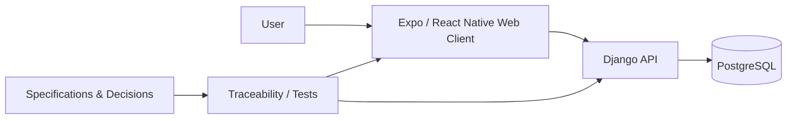

# Dotick — GitHub Repository Page Redesign Proposal

> **Purpose:** Make the public GitHub repository page feel like a polished product landing page while preserving Dotick's specification-first engineering model.
>
> **Scope:** Repository presentation only. This proposal does not change product behavior, implementation scope, or document authority.

---

## 1. Design Goals

The GitHub page should answer these questions within a few seconds:

1. **What is Dotick?**
2. **Why is it useful?**
3. **What is implemented today?**
4. **What technology does it use?**
5. **How can I run or understand it?**
6. **Where are the authoritative specifications?**

The page should look like a product repository, not only an engineering archive.

### Visual direction

- Minimal and clean
- Product-first, engineering-second
- Limited badge usage
- One strong hero/banner
- One high-quality product screenshot or mockup
- Short sections with clear hierarchy
- Dark/light GitHub themes must both remain readable

---

# 2. Repository Header / About Section

GitHub's repository header should be configured separately from `README.md`.

## Suggested description

> **Dotick is a specification-driven productivity system for organizing tasks, lists, routines, events, planning, and collaboration.**

Alternative shorter version:

> **A specification-driven productivity system built incrementally with Django, Expo, and PostgreSQL.**

## Suggested topics

```text
task-management
productivity
productivity-app
django
python
expo
react-native
typescript
postgresql
pwa
tdd
```

Do not add topics for major capabilities that are not yet implemented.

## Website

Add the public application URL when a stable public deployment exists.

Until then, leaving the website field empty is preferable to linking an unstable development instance.

---

# 3. Social Preview Image

Create a dedicated GitHub social preview image.

Recommended dimensions:

```text
1280 × 640 px
```

Suggested composition:

```text
┌──────────────────────────────────────────────────────────────┐
│                                                              │
│                    DOTICK                                    │
│                                                              │
│           Plan less. Know what to do next.                   │
│                                                              │
│        [ subtle application UI preview / abstract UI ]       │
│                                                              │
│             Django · Expo · PostgreSQL                       │
│                                                              │
└──────────────────────────────────────────────────────────────┘
```

Keep it visually simple. The image should remain understandable when displayed as a small Open Graph preview.

Suggested asset path:

```text
.github/assets/github-social-preview.png
```

---

# 4. README Hero

The current README starts immediately with project implementation status. The redesigned README should first establish product identity.

Suggested structure:

```html
<p align="center">
  
</p>

<h1 align="center">Dotick</h1>

<p align="center">
  A specification-driven productivity system for organizing what matters and knowing what to do next.
</p>

<p align="center">
  <!-- CI -->
  <!-- License -->
  <!-- Backend -->
  <!-- Client -->
</p>
```

Recommended badges once the corresponding information is stable:

- CI status
- License
- Python / Django
- TypeScript
- Expo
- PostgreSQL

Avoid badge walls. **Four to six badges maximum** is enough.

---

# 5. Product Screenshot

After the hero, show one strong visual rather than multiple small screenshots.

Suggested asset:

```text
.github/assets/dotick-overview.png
```

Possible composition:

- Desktop application centered
- Mobile/PWA view partially overlapping on one side
- Neutral or transparent background
- Main List / Task workflow visible
- Avoid screenshots of unfinished debugging UI

README example:

```md
<p align="center">
  
</p>
```

Until the UI is visually ready, omit the screenshot rather than publishing a temporary low-quality one.

---

# 6. "What is Dotick?"

This should be short and product-oriented.

Suggested copy:

> Dotick is a productivity system designed around Tasks, Lists, Routines, Events, planning, and collaboration. The project is developed incrementally from explicit product specifications, decisions, and testable requirements so implementation remains traceable to intended behavior.
>
> The goal is to combine fast day-to-day task management with a structured model that can grow into richer planning, scheduling, collaboration, automation, and intelligent assistance without losing behavioral consistency.

This section should not describe every feature.

---

# 7. Feature Overview

The README must distinguish **implemented capabilities** from **planned product scope**.

Recommended format:

## Current capabilities

Use only capabilities verified in the active implementation branch.

Example for the current `codex` implementation state:

- Identity foundation and authenticated access
- Folder / List / Column organization
- Basic Task creation and editing
- Task placement and status changes
- Inbox and Lists client surfaces
- Trash and restore behavior
- PostgreSQL-backed persistence
- Web and Expo-native client bundles

## Product direction

Future capabilities should be shown separately and explicitly marked as planned.

Example:

- Routines and completion tracking
- Events and calendar workflows
- Notifications and reminders
- Sharing and collaboration
- Richer planning views
- Voice interaction
- Additional intelligent assistance

Do **not** present roadmap features as already available.

---

# 8. Development Status

Dotick is explicitly increment-driven, so GitHub should expose that clearly.

Recommended section:

```md
## Development status

Dotick is developed in incremental releases. Each increment has a frozen implementation scope and is validated against the project specifications before the next increment expands the system.

| Increment | Scope | Status |
|---|---|---|
| 0 | Engineering foundation | ✅ Complete |
| 1 | Identity + Folder/List/Column + Basic Task MVP | 🚧 In progress |
| 2+ | See roadmap | ⏳ Planned |

See the [development roadmap](docs/planning/increment-roadmap.md) for the authoritative implementation order.
```

Important:

The status values in the README must be updated only when the corresponding increment gates actually change.

---

# 9. Tech Stack

Keep this visual and concise.

Recommended table:

| Layer | Technology |
|---|---|
| Client | Expo + React Native for Web + TypeScript |
| API | Django + Django REST framework / ASGI |
| Database | PostgreSQL |
| Testing | Python / client tests / end-to-end verification |
| CI | GitHub Actions |
| Development model | Incremental + iterative + TDD |

If technologies change, this table must follow the implementation rather than aspirational architecture.

---

# 10. Getting Started

The README should provide a quick path and delegate detailed setup to the development documentation.

Suggested form:

```md
## Getting started

### 1. Clone

```bash
git clone https://github.com/BehradHZ/Dotick.git
cd Dotick
```

### 2. Configure the environment

Follow the complete [environment setup guide](docs/development/environment-setup.md).

### 3. Run migrations

```bash
uv run python apps/api/manage.py migrate
```

### 4. Start the API

```bash
uv run python apps/api/manage.py runserver
```

### 5. Start the client

Follow the client commands documented in the environment setup guide.
```

Do not duplicate the full environment documentation inside README; duplicated setup instructions tend to drift.

---

# 11. Documentation / Source of Truth

The existing README's source-of-truth section is important and should remain, but it can be easier to scan.

Recommended presentation:

| Document | Role |
|---|---|
| [System Definition](../requirements/system-definition.md) | Canonical product behavior and scope |
| [Decision Register](../decision-register.md) | Consolidated product and engineering decisions |
| [Formal SRS](../requirements/srs.md) | Formal, testable requirements |
| [Domain Model](../design/domain-model.md) | Conceptual entities and relationships |
| [Development Roadmap](../planning/increment-roadmap.md) | Implementation order and increment scope |

Authority remains:

```text
System Definition
        ↓
Decision Register
        ↓
Formal SRS
        ↓
Domain Model / Design Documents
        ↓
Roadmap / derived references
```

Add a prominent link:

> **New to the project? Start with [`docs/README.md`](../README.md).**

---

# 12. Architecture Overview

A small architecture diagram would make the repository significantly easier to understand.

Example:



Later, this can be replaced with a custom SVG diagram if desired.

Recommended asset path for a custom version:

```text
.github/assets/architecture.svg
```

---

# 13. Repository Structure

Retain the existing repository overview but present it as a compact tree.

```text
Dotick/
├── apps/
│   ├── api/        Django API
│   └── client/     Expo / React Native client
├── docs/           Requirements, design and engineering documentation
├── e2e/            End-to-end verification
├── scripts/        Development and traceability tooling
└── README.md
```

This is easier to scan than a prose-only directory list.

---

# 14. Development Principles

Dotick's development process is unusual enough that it should be visible in the README.

Recommended section:

```md
## Engineering principles

- Specifications define intended behavior; implementation does not silently redefine them.
- Each increment has a frozen scope before implementation begins.
- Future-increment capabilities are not pulled prematurely into the schema or API.
- Requirements, implementation and tests remain traceable.
- Behavioral conflicts are resolved using the project's documented authority order.
- Every increment runs its applicable test, build and verification gates.
```

This tells contributors immediately how the repository is expected to evolve.

---

# 15. Contributing

Create:

```text
CONTRIBUTING.md
```

Suggested contents:

- Development prerequisites
- Branch workflow
- Commit conventions
- Test requirements
- Increment-scope rules
- Documentation update rules
- Pull request checklist

Keep contributor instructions out of the README except for one short link.

---

# 16. Pull Request Template

Create:

```text
.github/pull_request_template.md
```

Suggested template:

```md
## Summary

Describe the change.

## Increment

- [ ] Increment 0
- [ ] Increment 1
- [ ] Other / documentation-only

## Scope check

- [ ] The change stays inside the active increment scope.
- [ ] No future-increment capability was introduced unintentionally.

## Verification

- [ ] Tests added or updated where applicable
- [ ] Existing tests pass
- [ ] Documentation updated where applicable
- [ ] Traceability updated where applicable
```

---

# 17. Issue Templates

Recommended templates:

```text
.github/ISSUE_TEMPLATE/
├── bug.yml
├── feature.yml
└── documentation.yml
```

## Bug template

Collect:

- Description
- Reproduction steps
- Expected behavior
- Actual behavior
- Environment
- Logs/screenshots
- Related requirement, if known

## Feature template

Collect:

- Problem being solved
- Proposed behavior
- Current roadmap increment
- Related System Definition / SRS entry

A feature request should not automatically imply acceptance into the current implementation scope.

## Documentation template

Collect:

- Document/path
- Problem
- Conflicting source, if any
- Proposed correction

---

# 18. SECURITY.md

Create this when external users can meaningfully run or interact with the project.

Suggested purpose:

- How to report vulnerabilities privately
- Supported versions
- What **not** to disclose publicly in an issue

Do not invent a security email until there is an actual monitored address.

---

# 19. LICENSE

The repository should have an explicit license if the source is intended to be publicly reusable.

Important distinction:

**Publicly visible source code is not automatically open source.**

Before adding a license, decide what rights external users should have regarding:

- Use
- Modification
- Redistribution
- Commercial use
- Hosting / self-hosting

This is particularly important for Dotick because source visibility and product self-hosting policy are separate decisions.

---

# 20. Releases and Changelog

Once meaningful product increments are released, use GitHub Releases.

Suggested naming:

```text
v0.1.0 — Increment 1 MVP
v0.2.0 — Increment 2
...
```

Each release should contain:

- Implemented increment scope
- User-visible changes
- Migration notes
- Known limitations
- Verification status

Optionally maintain:

```text
CHANGELOG.md
```

Do not create release entries for every internal commit.

---

# 21. Recommended `.github/assets` Structure

```text
.github/
├── assets/
│   ├── dotick-logo.svg
│   ├── github-social-preview.png
│   ├── dotick-overview.png
│   └── architecture.svg
├── ISSUE_TEMPLATE/
│   ├── bug.yml
│   ├── feature.yml
│   └── documentation.yml
└── pull_request_template.md
```

Assets should be optimized for repository use and should not become a duplicate design-source directory.

---

# 22. Proposed Final README Order

The final `README.md` should approximately follow this order:

```text
1. Logo / Hero
2. Tagline
3. Badges
4. Product screenshot
5. What is Dotick?
6. Current capabilities
7. Development status
8. Tech stack
9. Getting started
10. Documentation / source of truth
11. Architecture overview
12. Repository structure
13. Engineering principles
14. Contributing
15. License
```

The first screen should communicate the **product**.

The middle should explain the **implementation**.

The lower part should guide **developers and contributors**.

---

# 23. Example README Mockup

The following is a rough Markdown mockup of how the redesigned landing page could feel.

---

<p align="center">
  <strong>DOTICK</strong>
</p>

<h1 align="center">Dotick</h1>

<p align="center">
  <strong>A specification-driven productivity system for organizing what matters and knowing what to do next.</strong>
</p>

<p align="center">
  Django · Expo · TypeScript · PostgreSQL
</p>

---

## What is Dotick?

Dotick is a productivity system designed around Tasks, Lists, Routines, Events, planning, and collaboration. It is built incrementally from explicit product specifications and testable requirements so implementation remains traceable to intended behavior.

## Current capabilities

- Authenticated identity foundation
- Folder / List / Column organization
- Basic Task workflows
- Inbox and Lists surfaces
- PostgreSQL persistence
- Web and Expo-native client support

## Development status

| Increment | Scope | Status |
|---|---|---|
| 0 | Engineering foundation | ✅ Complete |
| 1 | Identity + Folder/List/Column + Basic Task MVP | 🚧 In progress |
| 2+ | See roadmap | ⏳ Planned |

[View the development roadmap](../planning/increment-roadmap.md)

## Tech stack

| Layer | Technology |
|---|---|
| Client | Expo + React Native for Web + TypeScript |
| API | Django |
| Database | PostgreSQL |
| CI | GitHub Actions |

## Getting started

See the [environment setup guide](../development/environment-setup.md).

## Documentation

New contributors should start with [`docs/README.md`](../README.md).

Behavioral authority:

1. System Definition
2. Decision Register
3. Formal SRS
4. Domain Model / Design Documents
5. Roadmap / derived references

## Repository structure

```text
apps/api       Django API
apps/client    Expo / React Native client
docs           Product and engineering documentation
e2e            End-to-end verification
scripts        Development tooling
```

## Engineering principles

Dotick follows incremental, iterative, test-driven development. Each increment is scoped before implementation, and future capabilities are not introduced prematurely into the active schema or API.

---

# 24. Recommended Implementation Order

## Phase 1 — Immediate

1. Redesign `README.md`
2. Set repository description
3. Set repository topics
4. Add development-status table
5. Add concise tech-stack section
6. Improve repository structure presentation

## Phase 2 — Visual polish

1. Create Dotick logo asset
2. Create GitHub hero/social preview
3. Add polished application screenshot
4. Add architecture diagram

## Phase 3 — Contribution workflow

1. Add `CONTRIBUTING.md`
2. Add PR template
3. Add issue templates
4. Add security policy when appropriate
5. Decide and add license

## Phase 4 — Release maturity

1. GitHub Releases
2. Changelog
3. Public deployment link
4. Stable CI/release badges

---

# 25. Final Recommendation

The highest-value first change is the `README.md` redesign.

The current repository already contains strong engineering documentation. The GitHub landing page should therefore avoid duplicating that documentation and instead act as a clean navigation layer:

```text
Product identity
        ↓
Current implementation status
        ↓
Quick technical overview
        ↓
Run the project
        ↓
Enter the authoritative documentation
```

This gives Dotick a stronger public identity without weakening its specification-driven development model.
