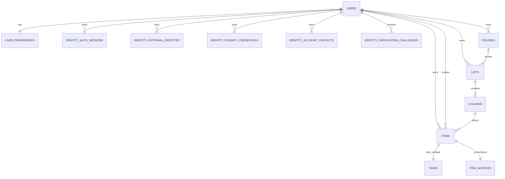

# Increment 1 Initial Physical ERD

> **Status:** Initial physical ERD finalized for Increment 1 design.
>
> **Date:** 2026-09-11
>
> **Database:** PostgreSQL
>
> **Authority:** System Definition → Decision Register → Formal SRS → `docs/design/data-model.md` → this ERD.

## 1. Scope

This ERD captures the physical persistence boundary required for Increment 1:

- identity/account/session foundations required by I1;
- personal Folder/List/Column organization;
- Item base identity/ownership/placement;
- Basic Task subtype;
- Source/provenance.

It deliberately excludes Increment 2+ scheduling, Event, hierarchy, dependency, priority, rich content/comments, recurrence/reminders, Group ownership/sharing, sync clocks, and audit/history tables.

## 2. Physical relationship diagram



## 3. Core physical tables

### `users`

Primary account identity table.

Key columns:

- `id uuid PK`
- `email`
- encoded `password`
- account/profile fields owned by identity design
- framework-required account state/timestamps

The exact identity columns remain defined by the identity migrations and `data-model.md`; the ERD depends only on stable `users.id` as the internal User key.

### `user_preferences`

- `user_id uuid PK/FK -> users.id`
- `timezone`
- timestamps

I1 requires timezone baseline only. I10 day-boundary behavior is not part of this ERD's behavioral scope.

### Authentication support tables

The following I1 identity tables reference `users.id` as defined by the authentication design/data model:

- `identity_auth_sessions`
- `identity_external_identities`
- `identity_passkey_credentials`
- `identity_passkey_challenges`
- `identity_account_contacts`
- `identity_contact_verification_challenges`
- `identity_verification_challenges`

These tables support authentication and account verification; they are not part of Task ownership/provenance.

## 4. Organization tables

### `folders`

```text
id              uuid PK
owner_user_id   uuid FK -> users.id NOT NULL
title           varchar NOT NULL
position        integer NOT NULL
is_trashed      boolean NOT NULL
trashed_at      timestamptz NULL
created_at      timestamptz NOT NULL
updated_at      timestamptz NOT NULL
```

Important constraints/index intent:

- owner-scoped queries;
- non-negative position;
- title normalized/non-empty at application and/or DB constraint boundary;
- no blind cascade behavior that would destroy child Lists.

### `lists`

```text
id              uuid PK
owner_user_id   uuid FK -> users.id NOT NULL
folder_id       uuid FK -> folders.id NULL
title           varchar NOT NULL
position        integer NOT NULL
is_inbox        boolean NOT NULL
is_trashed      boolean NOT NULL
trashed_at      timestamptz NULL
created_at      timestamptz NOT NULL
updated_at      timestamptz NOT NULL
```

Important invariants:

- a List may be folderless (`folder_id IS NULL`);
- Inbox is represented by a concrete owned List;
- at most one Inbox List per owner via partial uniqueness;
- if `folder_id` is present, service/write validation must ensure Folder and List belong to the same owner.

### `columns`

```text
id          uuid PK
list_id     uuid FK -> lists.id NOT NULL
title       varchar NOT NULL
position    integer NOT NULL
is_default  boolean NOT NULL
created_at  timestamptz NOT NULL
updated_at  timestamptz NOT NULL
```

Important invariants:

- every List has at least one Column;
- every List has exactly one default Column through transactional creation plus uniqueness enforcement;
- partial unique constraint on `(list_id) WHERE is_default` prevents multiple defaults;
- `Tab` and `Section` do not exist as separate physical tables.

## 5. Item and Task tables

### `items`

```text
id                       uuid PK
kind                     varchar NOT NULL
owner_user_id            uuid FK -> users.id NOT NULL
created_by_user_id       uuid FK -> users.id NOT NULL
column_id                uuid FK -> columns.id NOT NULL
title                    varchar NOT NULL
is_trashed               boolean NOT NULL DEFAULT false
trashed_at               timestamptz NULL
trash_origin_column_id   uuid FK -> columns.id NULL
version                  bigint NOT NULL
creation_operation_id    uuid NOT NULL
creation_intent_digest   varchar NOT NULL
created_at               timestamptz NOT NULL
updated_at               timestamptz NOT NULL
```

I1 invariants:

- `kind = 'task'` is the only I1 Item kind;
- UUID identity is stable across edit/move/status/Trash/restore;
- `owner_user_id` is authorization ownership;
- `created_by_user_id` is historical creator attribution;
- `column_id` is concrete placement; List is derived through Column;
- `version >= 1` and increments atomically on accepted mutation;
- owner-scoped `creation_operation_id` supports idempotent creation;
- title is non-empty;
- destination Column ownership must match Item owner in I1 personal scope.

### `tasks`

```text
item_id   uuid PK/FK -> items.id ON DELETE CASCADE
status    varchar NOT NULL
```

I1 status constraint:

```text
status IN ('todo', 'done', 'wont_do')
```

No scheduling, deadline, priority, dependency, hierarchy, recurrence, or reminder columns exist in the I1 Task table.

## 6. Source/provenance table

### `item_sources`

```text
item_id               uuid PK/FK -> items.id ON DELETE CASCADE
platform              varchar NOT NULL
external_account_id   varchar NULL
external_id           varchar NULL
```

Rules:

- exactly one Source row per I1 Item;
- `manual` is a valid platform;
- Source is provenance only;
- Source never determines `owner_user_id` or authorization;
- complete external identities may receive a provider-scoped uniqueness constraint such as `(platform, external_account_id, external_id)` with explicit NULL semantics.

## 7. Ownership chains

### Organization ownership

```text
Column -> List -> owner_user_id
Folder --------> owner_user_id
```

### Item ownership

```text
Item.owner_user_id -> User
Item.column_id -> Column -> List -> owner_user_id
```

For I1 personal placement, the Item owner and destination List owner must match. This is enforced in service/write logic and should be covered by integration tests; a simple FK alone cannot express the cross-table owner equality invariant.

### Creator and provenance

```text
Item.created_by_user_id -> User
Item -> ItemSource
```

Neither creator nor Source is used as an ownership shortcut.

## 8. Cardinality and transactional invariants

The physical schema plus write transactions must preserve:

1. One `items` row with `kind='task'` has exactly one `tasks` row.
2. Every I1 Item has exactly one `item_sources` row.
3. A new List and its default Column are created atomically.
4. A new Item, Task subtype, and Source are created atomically.
5. Inbox/default placement always resolves to a concrete Column.
6. `owner_user_id` and `created_by_user_id` are stored independently even when equal in I1 personal creation.
7. A Task status mutation changes `tasks.status` and Item mutation metadata/version without changing Item identity.
8. Trash is orthogonal to Task status: `items.is_trashed` does not create a new Task status.

## 9. Index baseline

Minimum I1 index/constraint intent:

```text
folders(owner_user_id, position)
lists(owner_user_id, folder_id, position)
columns(list_id, position)
UNIQUE columns(list_id) WHERE is_default
UNIQUE lists(owner_user_id) WHERE is_inbox
items(owner_user_id, is_trashed, updated_at DESC)
items(column_id, is_trashed, updated_at DESC)
items(owner_user_id, kind, is_trashed)
UNIQUE items(owner_user_id, creation_operation_id)
```

External Source uniqueness is added only for rows with a complete external identity and explicit NULL handling.

## 10. Deliberately absent from I1 physical schema

The following must not appear merely as reserved/unused columns or premature tables:

- `due_at`, `end_at`, all-day date, `deadline_at`, `grace_period_days`;
- `Overdue`, `Missed`, `Skipped` machinery;
- Event tables;
- `blocked_by` / dependency tables;
- priority;
- structural/reference hierarchy;
- rich description/content blocks;
- comments;
- tags;
- recurrence/reminders;
- Group ownership/sharing/roles;
- sync clocks, change branches, history/audit tables.

They are introduced only in their owning increments.

## 11. Design consistency summary

This ERD preserves the key I1 separations:

```text
ownership         -> items.owner_user_id
creator           -> items.created_by_user_id
source/provenance -> item_sources
Task outcome      -> tasks.status
Resource lifecycle-> items.is_trashed
placement         -> items.column_id -> columns -> lists
```

That separation keeps Increment 1 minimal while remaining compatible with later collaboration and sync/history evolution without implementing those later capabilities early.
