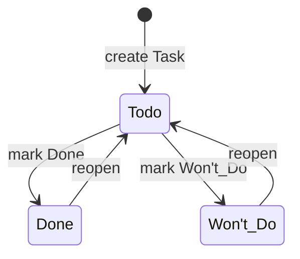

# Increment 1 Basic Task State Diagram

> **Status:** Formal analysis artifact for Increment 1.
>
> **Date:** 2026-09-11
>
> **Authority:** System Definition Task lifecycle rules → Decision Register → `SRS-TASK-001`, `SRS-TASK-014`, `SRS-TASK-020` → this analysis artifact.

## 1. Scope

Increment 1 exposes only the basic user-driven Task states:

```text
Todo
Done
Won't_Do
```

Time-derived/system-controlled states such as `Overdue`, `Missed`, and `Skipped` are deliberately excluded from I1 and belong to Increment 2 together with scheduling/deadline behavior.

## 2. State meanings

### `Todo`

The Task is active/open and has not been resolved by a user-driven outcome.

### `Done`

The User explicitly indicates that the Task has been completed successfully.

### `Won't_Do`

The User explicitly indicates that the Task will not be completed. This is a deliberate outcome and must not be treated as equivalent to `Done`.

## 3. Minimum required transition graph



This is the required I1 transition model. Direct `Done <-> Won't_Do` conversion is not required by I1. A client can reopen to `Todo` and then choose the other outcome if needed. Later increments may refine outcome-editing behavior only through an explicit requirement/design update.

## 4. Transition table

| From | Action | To | I1 rule |
|---|---|---|---|
| creation | create Task | `Todo` | Every new Basic Task starts as `Todo`. |
| `Todo` | mark complete | `Done` | User-driven. |
| `Todo` | mark won't do | `Won't_Do` | User-driven. |
| `Done` | reopen | `Todo` | User-driven. |
| `Won't_Do` | reopen | `Todo` | User-driven. |

## 5. Invariants

1. `status` belongs to Task, not the common Item base.
2. New I1 Tasks start as `Todo`.
3. `Done` and `Won't_Do` are distinct user outcomes.
4. Reopening either resolved state returns the same Task identity to `Todo`.
5. Status changes do not recreate the Item or change its UUID.
6. Status changes do not change owner, creator, source/provenance, or placement.
7. Accepted status changes increment the server-owned optimistic `version` and update `updated_at` atomically.
8. Stale-version status mutations are rejected rather than silently overwriting a newer state.
9. A User may mutate only Tasks inside their authorized ownership scope.
10. I1 must reject direct user selection of `Overdue`, `Missed`, `Skipped`, or other later states.
11. I1 status semantics do not require scheduling data; an unscheduled Task may be `Todo`, `Done`, or `Won't_Do`.

## 6. No-op and invalid requests

- Sending the current state again need not create a semantic transition; API design may treat it as idempotent/no-op if contractually defined.
- An unknown status value is validation failure.
- `Overdue`, `Missed`, and `Skipped` are invalid I1 user-selected values.
- A stale expected version produces a conflict and leaves persisted state unchanged.
- Cross-user or inaccessible Task identifiers do not expose foreign Task state.

## 7. Interaction with Trash

Trash is a separate lifecycle axis from Task outcome status.

A Task may retain its last Task status while `is_trashed = true`; Trash does not introduce a fourth Task status. Restoring a Task restores the Resource lifecycle visibility/placement behavior and does not implicitly reinterpret `Done` as `Todo` or vice versa.

Therefore:

```text
Task outcome state: Todo | Done | Won't_Do
Resource lifecycle:     active | trashed
```

These are orthogonal concepts.

## 8. Increment 2 handoff

Increment 2 adds schedule-derived behavior. It may introduce visible/system-controlled states such as `Overdue`, `Missed`, and `Skipped`, but it must preserve the distinction between user-driven outcomes and system-derived lifecycle states established here.

I1 must not add unused scheduling columns or future status machinery merely to anticipate I2.

## 9. Acceptance scenarios

- New Task is `Todo`.
- Owner changes `Todo -> Done`.
- Owner changes `Todo -> Won't_Do`.
- Owner reopens `Done -> Todo`.
- Owner reopens `Won't_Do -> Todo`.
- Stale status mutation is rejected.
- Another User cannot read or mutate the Task status.
- I1 rejects `Overdue`, `Missed`, and `Skipped` as client-selected states.
- Status mutation preserves Task ID, owner, creator, source, and Column placement.
